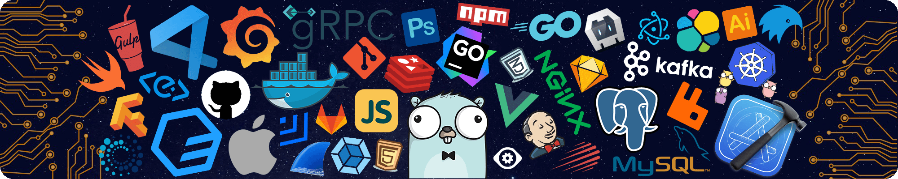

### Backend Engineer | Distributed Systems | AI Applications

<a href="https://github.com/YANG66-bot">GitHub</a> |
<a href="mailto:yangmingxue0927@gmail.com">Email</a>

 
 

---

## About

Backend engineer interested in **high-performance distributed systems** and **practical AI applications**. I enjoy designing reliable services, exploring system internals, and building clean, efficient engineering workflows.

- **Education:** Computer Science and Technology | Expected graduation in 2027
- **Focus:** Backend architecture, microservice communication, and LLM applications
- **Approach:** Architecture-first design with a strong focus on clarity and performance

## Tech Stack

<strong>Languages</strong>

 

<strong>Backend & Architecture</strong>

 

<strong>AI & Frontend</strong>

 
Also exploring: Spring Cloud | gRPC | Project Panama | Spring AI | LangChain4j | uni-app

## Current Interests

- **Distributed systems:** Hybrid services across `Java (Spring)`, `Go`, and `Rust`, connected through **gRPC** and **Project Panama**.
- **AI platforms:** Semantic search, dynamic retrieval, and intelligent recommendations powered by **Spring AI**.

<picture>
  <source media="(prefers-color-scheme: dark)" srcset="https://raw.githubusercontent.com/YANG66-bot/YANG66-bot/output/github-contribution-grid-snake-dark.svg">
  <source media="(prefers-color-scheme: light)" srcset="https://raw.githubusercontent.com/YANG66-bot/YANG66-bot/output/github-contribution-grid-snake.svg">
  
</picture>

 

### Let's build something meaningful.

